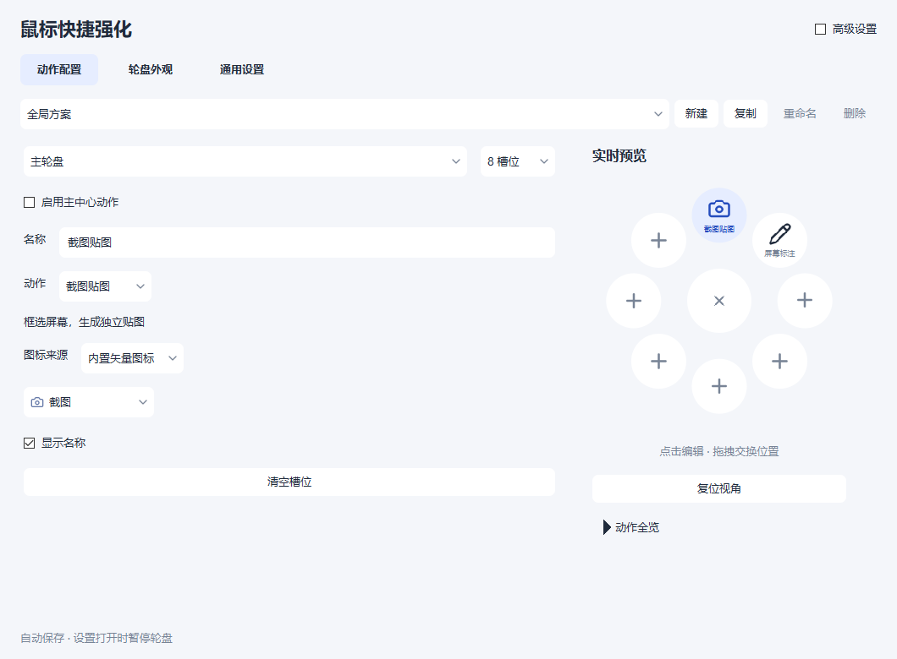

# MouseWheel · 鼠标快捷强化

**按住中键，把常用应用和桌面工具带到鼠标旁。**

[](https://github.com/zainSama233/MouseWheel/actions/workflows/repository.yml)
[](https://github.com/zainSama233/MouseWheel/actions/workflows/macos.yml)
[](LICENSE)

[下载预览版](https://github.com/zainSama233/MouseWheel/releases/tag/v0.7.0) · [使用手册 / Wiki](docs/README.md) · [反馈问题](https://github.com/zainSama233/MouseWheel/issues) · [参与开发](CONTRIBUTING.md)

MouseWheel 是一个单手操作的快捷轮盘：按住中键、移动选择、松开执行。把常用应用、网页、截图贴图和屏幕标注放进轮盘，少找几次窗口，少绕几次菜单。设置即时保存，复杂选项默认收进高级设置。



## 能做什么

- **一只手就够了**：4 / 8 / 12 个槽位，支持两级轮盘，也能为不同应用切换专属方案。
- **把常用入口放在一起**：应用、网页、文件夹、快捷键、命令和平台支持的窗口、系统动作。
- **截图和标注各做各的**：截图可以贴在桌面参考；屏幕标注能直接在桌面画线、箭头、形状和文字。
- **按自己的习惯摆放**：紧凑扇区、悬浮圆形、胶囊、蜂巢四种形态；导入 SVG / PNG / ICO / JPG，拖拽调整位置。
- **日常够用，细节可选**：主题、OCR、全屏暂停、应用排除和四种界面语言；精细排版需要时再打开。

## 下载与上手

当前版本是 **0.7.0 预览版**。无需自行编译：

| 系统 | 下载 | 说明 |
| --- | --- | --- |
| Windows 10 1809+ / Windows 11 x64 | [单 EXE 便携版](https://github.com/zainSama233/MouseWheel/releases/download/v0.7.0/MouseWheel-Portable.exe) | 放到可写文件夹，双击运行 |
| Windows 目录版 | [ZIP 压缩包](https://github.com/zainSama233/MouseWheel/releases/download/v0.7.0/MouseWheel-windows-x64.zip) | 完整解压后运行 |
| macOS 12+，Intel / Apple 芯片 | [通用应用包](https://github.com/zainSama233/MouseWheel/releases/download/v0.7.0/MouseWheel-macos-universal.zip) | 实验性适配，需授予系统权限 |

1. 打开设置，点击右侧轮盘的一个槽位，选好动作。
2. 填入应用或网址，也可以直接选择截图贴图、屏幕标注。
3. **关闭设置窗口**，按住中键，移到目标后松开。

Windows 单 EXE 首次启动会在旁边生成隐藏的运行依赖目录；配置和导入图标也保存在本地。备份、更新、取消操作和两级轮盘用法见 [使用手册](docs/usage.md)。

Windows 10 已实测，Windows 11 仍待专项验收。macOS 已通过双架构构建和专项测试，真实鼠标、多屏、授权流程仍待实机验收，尚未完成 Developer ID 签名和公证。完整范围见 [验证记录](docs/validation.md)。

## 从源码构建

```bash
git clone https://github.com/zainSama233/MouseWheel.git
cd MouseWheel
```

项目使用 C++20、CMake 和 Qt 6，固定依赖版本见 [toolchain.json](toolchain.json)。

**Windows**：准备 Python 3.11+，在 PowerShell 中运行。引导脚本会准备工具链，缺少 MSVC 时会启动 Build Tools 安装。

```powershell
./scripts/bootstrap.ps1
./scripts/build.ps1 -Package
./tests/portable_tests.ps1
```

**macOS**：准备 Xcode 命令行工具、CMake 和对应版本的 Qt macOS SDK。

```bash
export QT_ROOT=/path/to/Qt/6.8.3/macos
bash scripts/build-macos.sh
```

产物位于 `dist/`。开发入口、针对性测试和发布流程见 [贡献指南](CONTRIBUTING.md)。

## 文档与参与

[文档 / Wiki](docs/README.md)统一放在源码仓库中，和代码一起维护。

- 使用问题或功能建议：[提交 Issue](https://github.com/zainSama233/MouseWheel/issues)。
- 修复或新功能：[贡献指南](CONTRIBUTING.md)。
- 维护与发布：[维护指南](docs/maintaining.md)。
- 涉及敏感信息的问题：[安全反馈](SECURITY.md)。

## Contributors

感谢一起把 MouseWheel 做得更好的人：

- [zainSama233](https://github.com/zainSama233)
- [Xinxn](https://github.com/XinxinTree)

## License 与致谢

项目采用 [MIT License](LICENSE)。第三方组件保留各自许可，详见 [第三方声明](licenses/NOTICE.md)。

轮盘与配置交互参考 [StarPie](https://github.com/SoftBlack42/StarPie)，屏幕标注体验参考 [MarkerOn](https://github.com/ifer47/markeron)。感谢这些项目提供的思路。
